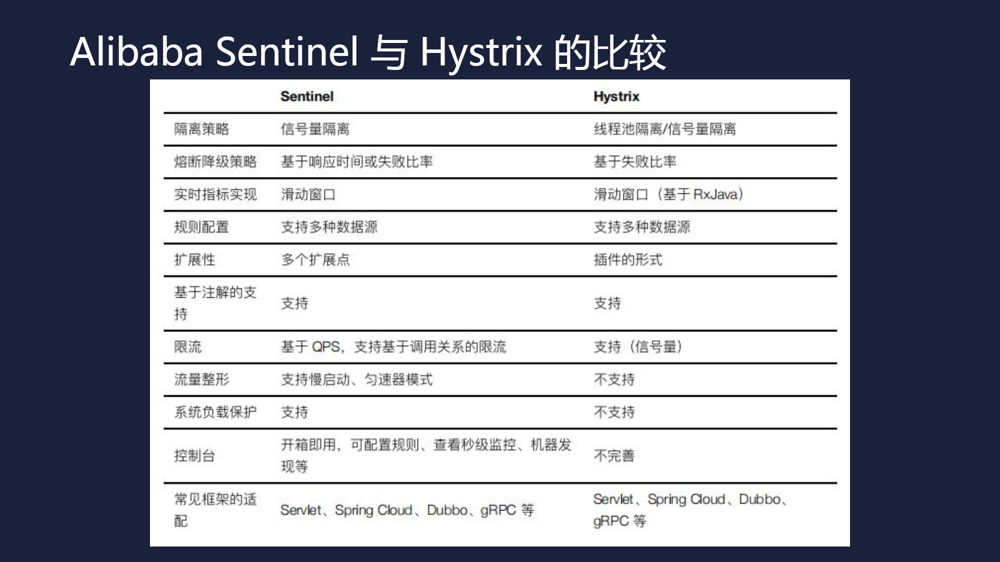
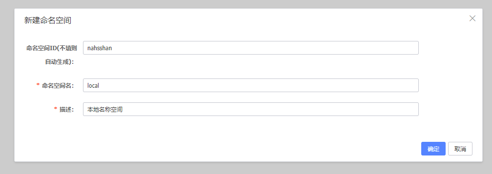
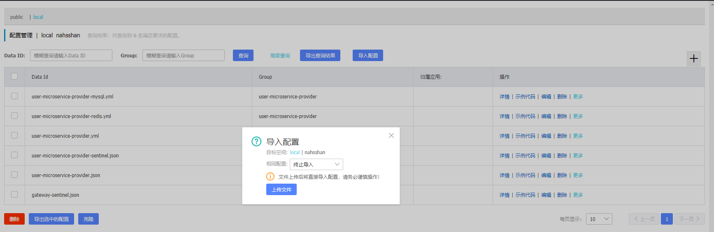

# spring-cloud-learn
## 前言
Spring Cloud 越来越流行需要学习了解
## 项目介绍
   项目使用 Nacos 作为远程配置中心实现 one jar one docker run everywhere
   实现Spring Cloud 集成 Ribbon、Feign、Geteway、Mybatis、Redisson

### Spring Cloud 与 Spring Boot 版本
| Spring Cloud | Spring Boot |
| :----: | :----: |
| Hoxton.SR3 | 2.2.5.RELEASE |
| Greenwich | 2.1.x |
| Finchley | 2.0.x |
| Edgware | 1.5.x |
| Dalston | 1.5.x |
| Camden | 1.4.x |
| Brixton | 1.3.x |
| Angel | 1.2.x |

### 项目结构
```lua
spring-cloud-learn
├── spring-cloud-learn-common -- 框架公共模块
├── spring-cloud-learn-eureka-server -- Eureka Server 注册中心
├── spring-cloud-learn-eureka-client -- Eureka 客户端 服务消费者
├── spring-cloud-learn-getway -- Getway 服务网关
├── spring-cloud-learn-zuul -- Zuul 服务网关
├── spring-cloud-learn-ribbon -- Ribbon 负载均衡
├── spring-cloud-learn-user -- 用户模块
|    ├── spring-cloud-learn-user-common -- 用户公共模块
|    ├── spring-cloud-learn-user-mapper -- 用户Dao
|    ├── spring-cloud-learn-user-microservice-api -- 用户功能接口包
|    ├── spring-cloud-learn-user-microservice-api-provider --用户功能服务提供者
|    └── spring-cloud-learn-user-microservice-controller -- 用户模块Controller
```
#### 开发环境：
- Jdk8+
- Mysql5.7+
- Redis
- Nacos
- Sentinel
- Docker
- Docker Compose

### 开发环境搭建

环境搭建和系统部署

### 资源下载
- [Mysql主从](https://github.com/ZhuJunJi/mysql-slave "Mysql主从")
- [Redis哨兵](https://github.com/ZhuJunJi/redis-sentinel "Redis哨兵")
- [Docker](https://docs.docker.com/install/linux/docker-ce/centos/ "Docker")
- [Docker Compose](https://docs.docker.com/compose/install/ "Docker Compose")
- [Maven](http://maven.apache.org/download.cgi "Maven")
- [Nacos](https://github.com/alibaba/nacos/releases "Nacos")
- [Nacos 集群搭建](https://nacos.io/zh-cn/docs/cluster-mode-quick-start.html "Nacos 集群搭建")
- [Alibaba Sentinel](https://github.com/alibaba/Sentinel "Alibaba Sentinel")


### Nacos配置规范
用namespace来区分各个环境的配置

配置文件名称空间：           local、dev、prd

Sentinel流控策略名称空间：   sentinel-dev、sentinel-test、sentinel-prd

dataId:初始化配置文件统一为： ${spring.application.name}.yml

其他如mysql、redis：        ${spring.application.name}-mysql.yml、${spring.application.name}-redis.yml

group统一为：               ${spring.application.name}

### 启动步骤
#### 1、安装Nacos Version 1.2.1
使用Mysql 8 启动报错问题
[参考Nacos issues 2042解决](https://github.com/alibaba/nacos/issues/2042)
在nacos BASE_DIR 下创建 /plugins/mysql/目录
将 mysql-connector-java-8.0.19.jar 驱动包放入新建的目录下
修改 /conf/application.properties db.url.0 加上时区参数 serverTimezone=Asia/Shanghai
```properties
db.url.0=jdbc:mysql://127.0.0.1:3306/nacos?characterEncoding=utf8&connectTimeout=1000&socketTimeout=3000&autoReconnect=true&serverTimezone=Asia/Shanghai
```
##### 1.1、启动完成后创建名称空间

##### 1.2、导入配置文件


#### 2、安装Sentinel Version 1.7.2
##### 2.1 [下载 sentinel-dashboard-1.7.2.jar](https://github.com/alibaba/Sentinel/releases/tag/1.7.2)
##### 2.2 [启动配置项](https://github.com/alibaba/Sentinel/wiki/%E5%90%AF%E5%8A%A8%E9%85%8D%E7%BD%AE%E9%A1%B9)
```shell script
java -Dserver.address=127.0.0.1 -Dserver.port=7200 -Dcsp.sentinel.heartbeat.client.ip=127.0.0.1 -Dcsp.sentinel.dashboard.server=127.0.0.1:7200 -Dproject.name=sentinel-dashboard -jar sentinel-dashboard-1.7.2.jar
```
#### 3、配置 Hosts
```shell script
127.0.0.1 www.nahsshan.com
```
#### 4、启动 user-microservice-server
#### 5、启动 gateway